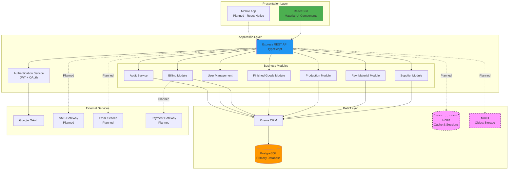
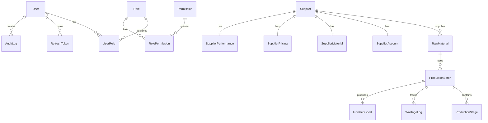
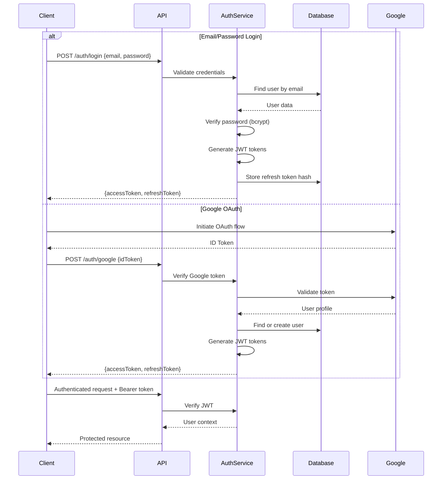
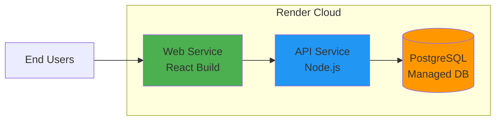
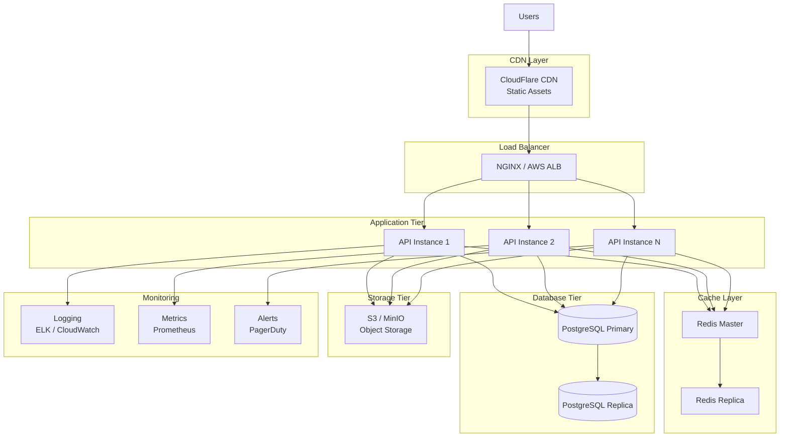

# Yarn Management System - System Architecture

## Architecture Overview

The Yarn Management System follows a **modern three-tier architecture** with clear separation of concerns, designed for scalability, maintainability, and cloud-native deployment.



## Technology Stack Details

### Frontend Architecture

#### Core Technologies
- **React 18**: Modern functional components with hooks
- **TypeScript**: Type-safe development
- **Vite**: Lightning-fast build tool and dev server
- **React Router v6**: Client-side routing

#### UI/UX Layer
- **Material-UI (MUI)**: Enterprise-grade component library
- **Recharts**: Declarative charting library
- **Custom CSS**: Responsive design with CSS variables

#### State Management
- **React Context API**: Global state (Auth, Theme, Notifications)
- **Local State**: Component-level state with useState/useReducer
- **Future**: Consider Redux Toolkit for complex state

#### Key Frontend Patterns
```
src/
├── components/          # Reusable UI components
│   ├── AppLayout.tsx   # Main layout wrapper
│   ├── ProtectedRoute.tsx
│   └── [Feature]Dashboard.tsx
├── pages/              # Route-level components
│   ├── DashboardPage.tsx
│   ├── ProcurementPage.tsx
│   └── BillingPage.tsx
├── context/            # Global state providers
│   ├── AuthContext.tsx
│   ├── ThemeContext.tsx
│   └── NotificationContext.tsx
├── hooks/              # Custom React hooks
│   └── useAuth.ts
└── lib/                # Utilities and helpers
    └── api.ts          # API client
```

### Backend Architecture

#### Core Technologies
- **Node.js**: JavaScript runtime
- **Express**: Web application framework
- **TypeScript**: Type-safe server-side code
- **Prisma**: Next-generation ORM

#### API Design
- **RESTful Architecture**: Resource-based endpoints
- **JSON Communication**: Request/response format
- **JWT Authentication**: Stateless auth tokens
- **Middleware Pipeline**: Request processing chain

#### Backend Structure
```
src/
├── app.ts              # Express app configuration
├── index.ts            # Server entry point
├── config/
│   └── env.ts          # Environment validation (Zod)
├── middleware/
│   ├── authenticate.ts # JWT verification
│   ├── authorize.ts    # Permission checking
│   └── errorHandler.ts # Global error handling
├── modules/            # Feature modules
│   ├── auth/
│   │   ├── auth.service.ts
│   │   └── auth.routes.ts
│   ├── suppliers/
│   ├── raw-materials/
│   ├── manufacturing/
│   ├── billing/
│   └── users/
├── prisma/
│   └── client.ts       # Prisma client instance
└── types/
    └── express.d.ts    # Type augmentation
```

### Database Architecture

#### PostgreSQL Schema Design

**Core Principles:**
- Normalized relational design
- Foreign key constraints for referential integrity
- Indexes on frequently queried columns
- Audit trails for compliance
- Soft deletes where applicable

**Key Entity Relationships:**



#### Database Models (Summary)

| Model | Purpose | Key Fields |
|-------|---------|------------|
| **User** | System users | email, passwordHash, mfaEnabled, status |
| **Role** | User roles | code, name, permissions |
| **Permission** | Granular permissions | code, name |
| **Supplier** | Supplier master data | name, gstin, supplierCode, status |
| **SupplierAccount** | Financial & compliance | gstNumber, panNumber, bankDetails |
| **SupplierMaterial** | Material specifications | materialsSupplied, qualityGrades, capacity |
| **SupplierPricing** | Pricing terms | basePricePerKg, paymentTerms |
| **SupplierPerformance** | KPIs & metrics | qualityRating, onTimeDelivery, riskLevel |
| **RawMaterial** | Inventory tracking | batchNo, quantity, qualityScore, status |
| **ProductionBatch** | Production tracking | batchNumber, currentStage, status |
| **ProductionStage** | Stage-level details | stageName, startTime, endTime, operator |
| **WastageLog** | Waste tracking | stage, quantity, wasteType, reason |
| **FinishedGood** | Final products | yarnCount, producedQuantity, qualityGrade |
| **AuditLog** | Compliance trail | action, entityType, metadata, timestamp |

### Security Architecture

#### Authentication Flow



#### Security Layers

1. **Transport Security**
   - HTTPS/TLS encryption (production)
   - Secure cookie flags (httpOnly, secure, sameSite)

2. **Authentication**
   - JWT access tokens (short-lived: 15 minutes)
   - Refresh tokens (long-lived: 30 days, hashed in DB)
   - Multi-factor authentication (TOTP)
   - OAuth 2.0 (Google)

3. **Authorization**
   - Role-based access control (RBAC)
   - Permission-based granular access
   - Middleware-enforced authorization

4. **Data Protection**
   - Password hashing (bcrypt, 10 rounds)
   - Token hashing for refresh tokens
   - Input validation (Zod schemas)
   - SQL injection prevention (Prisma parameterized queries)

5. **Audit & Compliance**
   - Comprehensive audit logging
   - User action tracking
   - IP and user agent logging
   - Timestamp-based audit trails

### API Architecture

#### REST API Design Principles

**Endpoint Structure:**
```
/api/v1/{resource}/{id?}/{sub-resource?}
```

**HTTP Methods:**
- `GET`: Retrieve resources
- `POST`: Create new resources
- `PUT/PATCH`: Update resources
- `DELETE`: Remove resources

**Current API Modules:**

| Module | Base Path | Key Endpoints |
|--------|-----------|---------------|
| Auth | `/auth` | `/login`, `/refresh`, `/logout`, `/google`, `/mfa/*` |
| Suppliers | `/suppliers` | `/`, `/:id`, `/search` |
| Raw Materials | `/raw-materials` | `/`, `/:id` |
| Manufacturing | `/manufacturing` | `/batches`, `/batches/:id`, `/stages` |
| Finished Goods | `/finished-goods` | `/` |
| Billing | `/billing` | `/customers`, `/invoices`, `/invoices/:id` |
| Users | `/users` | `/`, `/:id`, `/roles` |

#### Response Format Standards

**Success Response:**
```json
{
  "data": { /* resource or array */ },
  "meta": {
    "total": 100,
    "page": 1,
    "limit": 20
  }
}
```

**Error Response:**
```json
{
  "error": {
    "message": "Human-readable error",
    "code": "ERROR_CODE",
    "status": 400,
    "details": { /* additional context */ }
  }
}
```

### Infrastructure Architecture

#### Current Deployment (Render)



#### Planned Scalable Architecture



### Performance Optimization Strategies

#### Current Optimizations
- Prisma query optimization with selective field inclusion
- Database indexes on frequently queried columns
- React component memoization
- Vite build optimization

#### Planned Optimizations
1. **Caching Strategy**
   - Redis for session storage
   - Query result caching (5-15 min TTL)
   - Static asset caching (CDN)

2. **Database Optimization**
   - Read replicas for reporting queries
   - Connection pooling (PgBouncer)
   - Materialized views for complex analytics

3. **API Performance**
   - Response compression (gzip/brotli)
   - Pagination for large datasets
   - GraphQL for flexible data fetching (future)

4. **Frontend Performance**
   - Code splitting and lazy loading
   - Service workers for offline capability
   - Image optimization and lazy loading

### Scalability Considerations

#### Horizontal Scaling
- Stateless API design (JWT-based auth)
- Load balancer distribution
- Database connection pooling
- Microservices migration path

#### Vertical Scaling
- Database performance tuning
- Memory optimization
- CPU-intensive task offloading

#### Data Scaling
- Database sharding strategy (by tenant/region)
- Archive old data to cold storage
- Time-series data optimization

### Monitoring & Observability

#### Key Metrics to Track
1. **Application Metrics**
   - Request rate (req/sec)
   - Response time (p50, p95, p99)
   - Error rate (%)
   - Active users

2. **Infrastructure Metrics**
   - CPU utilization
   - Memory usage
   - Disk I/O
   - Network throughput

3. **Business Metrics**
   - User registrations
   - Feature adoption rates
   - Transaction volumes
   - Revenue metrics

#### Logging Strategy
- Structured JSON logging
- Log levels: ERROR, WARN, INFO, DEBUG
- Centralized log aggregation
- Log retention policies

### Disaster Recovery & Backup

#### Backup Strategy
- **Database**: Daily automated backups (30-day retention)
- **Files**: S3 versioning and replication
- **Configuration**: Infrastructure as Code (IaC)

#### Recovery Objectives
- **RTO (Recovery Time Objective)**: <4 hours
- **RPO (Recovery Point Objective)**: <1 hour

### Future Architecture Enhancements

1. **Microservices Migration**
   - Separate services for Auth, Billing, Production
   - Event-driven architecture (Kafka/RabbitMQ)
   - API Gateway (Kong/AWS API Gateway)

2. **Real-Time Features**
   - WebSocket support for live updates
   - Server-Sent Events (SSE) for notifications
   - Real-time production monitoring

3. **AI/ML Integration**
   - Predictive analytics service
   - Quality prediction models
   - Demand forecasting

4. **Multi-Tenancy**
   - Tenant isolation (schema-based or database-based)
   - Tenant-specific customization
   - Usage-based billing

## Conclusion

The Yarn Management System architecture is designed with **scalability, security, and maintainability** as core principles. The current implementation provides a solid foundation, while the planned enhancements ensure the system can grow to support thousands of users and millions of transactions.
